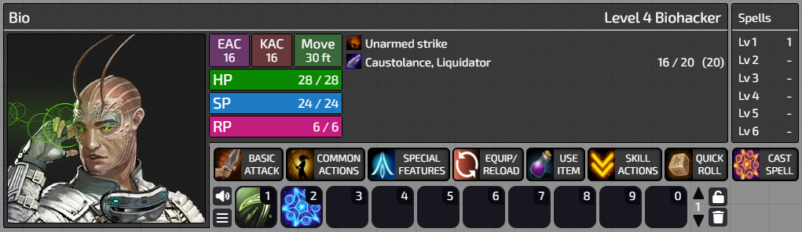
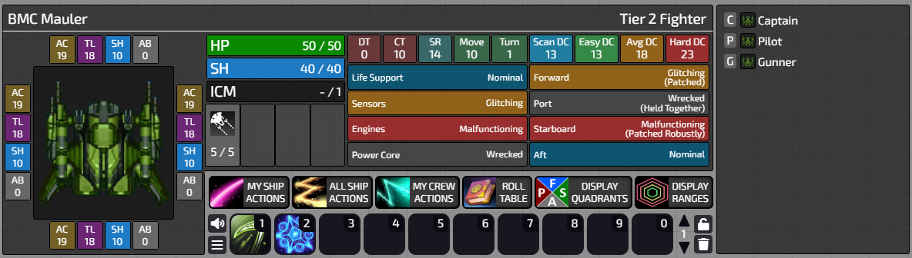

# Rubicon for Starfinder

Rubicon is an extension module for Foundry VTT which is designed to improve the Starfinder roleplaying experience. It was initially developed over a number of 'combat test' sessions that I performed with my brother prior to us starting our Starfinder roleplaying adventure. Since then I have continued to expand it with new features as needed by my roleplaying group.

## Features

### Heads-Up Display

Rubicon adds a new HUD which shows information about the selected token. The new HUD is wrapped around the macro bar on the bottom of the screen (the macro bar is moved slightly to the right to accomodate this).

There are currently two versions of this HUD.

#### Character/NPC HUD

When a character or NPC is selected, the heads-up display shows information about:
 * Level and class / challenge rating
 * EAC and KAC
 * Primary movement speed
 * Hit points, stamina and resolve
 * Equipped weapons
 * Free spell slots
 * Any active status conditions or timed effects, along with the remaining duration

Here's a screenshot of what the HUD looks like:

#### Starship HUD

When a starship is selected, the heads-up display shows information about:
 * The AC, TL, shield level and ablative armour level for each quadrant
 * Hit points and total shields
 * Equipped weapons which have limited ammunition, along with how much ammunition they have
 * Damage threshold and critical threshold
 * Sensor range
 * Move speed and turn distance
 * Scan DC (5 + 1.5*tier + defensive countermeasure bonus) - used by sensor related ship actions
 * Easy DC (10 + 1.5*tier) - used by the least difficult ship actions
 * Average DC (15 + 1.5*tier) - used by averagely difficult ship actions
 * Hard DC (20 + 1.5*tier) - used by the most difficult ship actions
 * Status of each starship system, including if it's patched

And for each crew member:
 * Name of crew member
 * Assigned crew role
 * Hit points and resolve (for non-NPC ships)
 * Crew members who have completed their action in this round are highlighted in red

Future plans are to also add:
 * The number of used and remaining ICM nodes for the round
 * Pending damage for each quadrant (maybe)

Here's a screenshot of what the HUD looks like:

### Quick Action Menus

Rubicon adds some quick action menus which allow you to easily perform common actions using the selected token without having to open the character sheet. Examples of things supported are: attacking, equipping/unequipping, reloading, casting spells, using consumables, and rolling skills. The quick menus also allow you to perform many common turn actions not supported out of the box (such as Harrying Fire) by inserting custom roll cards into the chat log.

During starship combat, a different set of quick action menus is displayed which allow you to perform crew actions for the selected starship. It filters the available actions depending on the combat phase and the roles currently assigned to the crew. There are also buttons to execute the quadrant and range display macros for the selected ship token so that you don't have to waste a macro button on these.

This frees up most uses of the macro bar, which is instead intended to be used for player-specific toggles (e.g. toggling feats on and off), or used by the GM for tasks that only need to be performed by the GM.

### Other Features

There are a few other small/minor features:

* Basic functions which can be used by the GM
* Small tweaks to Foundry's user interface styling
* Bug fixes and workarounds which are hacky and not really suitable to go into the sfrpg core

## Requirements
To use this module you will require:
- Foundry VTT version 13
- The Starfinder system fork located at https://github.com/Theleruby/foundryvtt-sfrpg (this module depends on some code changes present in the fork)

## How to install
Clone the repository and then copy the entire contents to the User/Data/modules/rubicon-sfrpg folder.

## License
Game content from Starfinder (e.g. the rules text used in the action files) is licensed under OGL. Everything else is licensed under the MIT license.

## Support
Use the roleplaying channel in my Discord server.
